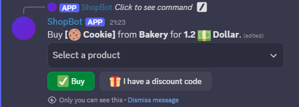
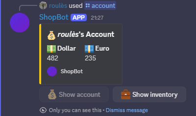
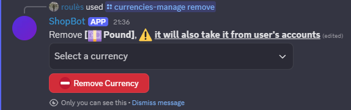
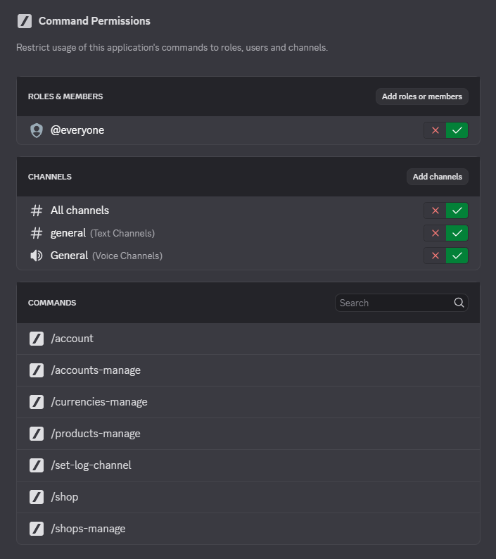

# ShopBot 2

### Summary:
- [Introduction](#introduction)
- [How to use](#how-to-use)
- [Documentation](#documentation)
- [Screenshots](#screenshots)
- [Road Map](#roadmap)
---
## Introduction

Hi 👋 I created a cool bot for you !
Let me introduce you **ShopBot**, this bot aims at helping to you create your own shops and currencies to fit the needs of your community, your RP server, or anything you need.  
<sub><sup>(See [screenshots](#screenshots))</sup></sub>
<br>

### Here is what the bot can do:

This bot uses the power of ***Slash Commands*** to let you interact with it with the **best UI** as possible (Embeds, Buttons, Select Menu). So you will **not have to worry** about remembering complex commands, the **bot does everything** for you, and prevents you from accidentally making errors.


You can **create** **currencies**, then use them in **shops** you created, in which you can add **products**, with a name, a description and a price.

Of course, you can **manage** these currencies, shops and products. You can **delete** the currencies and the shops.
You can **update** the name, description or price of the products.

Admins can **give** and **take** money to users and even **empty** an account, they can also **see** the account of anyone.
They can see logs (for purchase, give and take) by setting a log channel on your server.

Users can **see** their own account, and **buy** in shops.

<br>

Thanks to **Discord**'s features, you can customize the permissions for each command in the settings of your server.

You can check [screenshots](#screenshots) of the bot's commands to see how cool it is :D

<br>

If you love the bot, feel free to support me: 

<a href='https://ko-fi.com/roules_'></a>
<br>
<br>

---
<br>
Now, let's configure your bot, caution, you need to do it carefully

<br>

## How to use
This repo is the bot's source code, not a bot itself. <br>
To use it, you must host it yourself. There are several methods to do this, some are free, some are paid (Be careful that your hosting solution allows file editing, sometimes called local database, otherwise all the bot's data will be lost if the server restarts). <br>
Once you found the hoster for your bot, here are the steps to follow: <br>
We will first create the bot :
1. Go on [Discord Developer Portal](https://discord.com/developers/applications) and login
2. Click **New Application**, give your bot a name, accept the ToS and developer policy
3. In the **Installation** tab, untick **User Install**, and in **Install Link** select **None**
4. Copy the **Application ID** from the **General Information** tab, save it for later.
5. Select tab **Bot**, click **Reset Token**, copy the token, save it for later.
6. Cutomize the bot as you want (Profile picture, banner, name...). Below **Authorization Flow**, untick **Public Bot**, tick **Server Members Intent** 
7. Save changes.
8. In the **OAuth2** tab, in **Scopes**, select **bot** and **application.commands**, then tick the following permissions:
   * Read Messages/View Channels
   * Send Messages
   * Use Slash Commands
9. Select **Guild Install** and copy the generated URL
10. Follow this URL and add the bot to the server you want, accept everything, the bot should be added to your server !

Now, we can link the bot to the code, so you can start using it : 
1. You need to have [Node.js](https://nodejs.org/en) installed on your machine.
2. [Download my code](https://github.com/DragonJules/ShopBot/archive/refs/heads/main.zip) and extract it from the ZIP file (or clone the repo), open the folder where it's located, and open a terminal from here.
3. Install the required packages and compile the code by executing the following command:
```bash
npm install
```
4. In the bot folder, open the **config** folder, then open **config.json** in any text editor, fill it with the informations you saved previously, like following:
```json
{
  "clientId": "[The Application ID you have saved]",
  "token": "[The Token you have saved]",
  "logChannelId": "[The ID of the channel the log should be sent in]",
}
```


Your Bot is ready to be uploaded on the server ! The following steps may vary depending on your hosting solution.
1. Upload the whole **ShopBot-main** folder on the server.
2. Create a routine for restarting the server. Such that the following command is executed from the bot's folder each time the server is restarted.
```bash
npm run start
```
3. Open a terminal from the bot' folder and execute the following command :
```bash
npm run deploy /a
```
4. Restart the server, or run the following command : 
```bash
npm run start
```

All done ! You did it, your bot should be working perfectly ! 
If you have any problem with it, feel free to message me on Discord, or open an [issue on Github](https://github.com/DragonJules/ShopBot/issues)

---

## Documentation

### Here are all the commands available for the bot.

#### Commands for everyone:

*• Show user's account*
  `/account` <br>
 
*• Display the shops*
  `/shop` 

<br>

#### Admin commands:
`/set-log-channel`

*• Manage Currencies*
```
  /currencies-manage
    | create <name>
    | remove
```

*• Manage Shops*
```
  /shops-manage
    | create <name>
    | remove
    | edit <name/description> <new-value>
    | reorder *not implemented yet*
```

*• Manage products*
```
  /products-manage
    | add <name> <price> <description>
    | remove
    | edit <name/price/description> <new-value>
```

*• Manage users*
```
  /accounts-manage
    | view-account <target>
    | give <target> <amount>
    | take <target> <amount>
```

#### How to use admin commands ?
Commands that require selecting a specific Shop or Currency will prompt you to do so with a drop-down list after you executed the command.
For example, when creating a shop (`/shops-manage create <name>`) you select the currency after sending the command, and then the shop is created.
When you give some amount of any currency to a user, you first specify the amount and then select the currency. 
When deleting any shop or currency, you also do select it after sending the command.

This for you not to have to remember the name of each currency and shop to manage them.

The use of those command is made as intuitive as possible using Discord's slash-commands and message components.
If you encounter any issue with a command, you can open an [issue](https://github.com/DragonJules/ShopBot/issues).


## Screenshots 

### What members of the discord can see:
Shop <br>
   <br>
Buy | Account <br>
   

<br>

### Examples of what you as an administrator can see:
Create | Delete a currency: <br>
  

Create | Delete a shop: <br>
  


Configuring bot's commands permissions: <br>
 


<sub><sup>The screenshots come from the project I originally created the bot for.</sup></sub>


## Road Map
I plan to refactor the whole code base to migrate it to typescript and make it easier to update.
I will after that add the following features, some of which have been suggested by users :
- ✅ Inventory system
- Discount codes 
- ✅ Pagination system in shops
- Custom emojis as currency name or ability to add an emoji in addition to currency name
- ✅ New commands system, for easier use

All those changes will be made on this branch.

If you have a feature idea you think will fit this bot, feel free to suggest it [here](https://github.com/DragonJules/ShopBot/issues).

--- 

If something is missing in this document, please open an [issue](https://github.com/DragonJules/ShopBot/issues).
