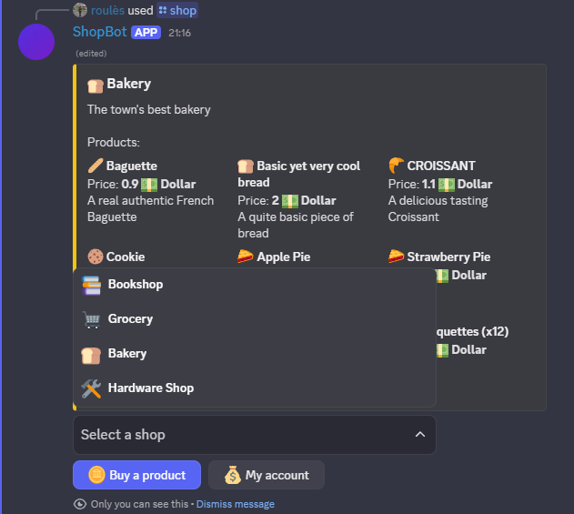
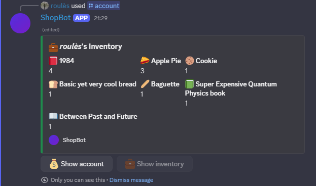
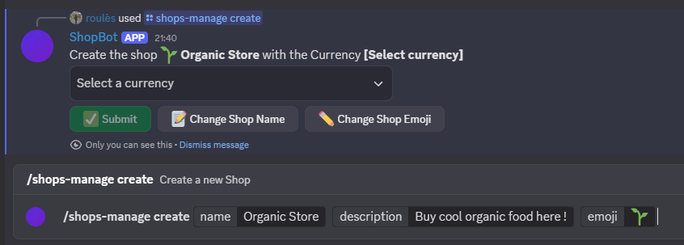
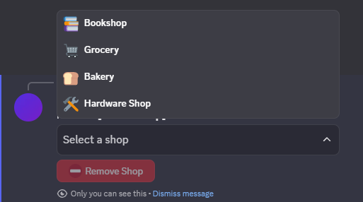

# ShopBot 2

### Contents
- [👋 Introduction](#introduction)
- [🚀 How to use](#-how-to-use)
- [📝 Documentation](#-documentation)
- [📸 Screenshots](#-screenshots)
- [🌟 Road Map](#-road-map)
- [⚖️ Legal Stuff](#%EF%B8%8F-legal-information)


## Introduction

### Hi 👋 <br>
I created a cool bot for you !
Let me introduce you **ShopBot**, this bot aims at helping to you create your own shops and currencies to fit the needs of your community, your RP server, or anything you need.  
<sub><sup>(See [screenshots](#-screenshots))</sup></sub>
<br>

### Here is what the bot can do:

This bot uses the power of ***Slash Commands*** to let you interact with it with the **best UI** as possible (Embeds, Buttons, Select Menu). So you will **not have to worry** about remembering complex commands, the **bot does everything** for you, and prevents you from accidentally making errors.


You can **create** **currencies**, then use them in **shops** you created, in which you can add **products**, with a name, a description and a price.

Of course, you can **manage** these currencies, shops and products. You can **delete** and **edit** them, if you want to change their name, description.. or get rid of them !

Admins can **give** and **take** money to users and even **empty** an account, they can also **see** the account and inventory of anyone.
They can see logs (for purchase, give and take) by setting a log channel on your server.

Users can **see** their own account and inventory, and **buy** in shops.

<br>

Thanks to **Discord**'s features, you can customize the permissions for each command in the settings of your server.

You can check [screenshots](#-screenshots) of the bot's commands to see how cool it is :D

<br>

If you love the bot, feel free to support me: 

<a href='https://ko-fi.com/B0B5L20B6' target='_blank'></a>

And don't forget to leave a ⭐ Star

<br>

It's now time to [configure the bot](#-how-to-use) !

## 🚀 How to use
This repo is the bot's source code, not a bot itself. <br>
To use it, you must host it yourself. There are several methods to do this, some are free, some are paid (Be careful that your hosting solution allows file editing, sometimes called local database, otherwise all the bot's data will be lost if the server restarts). <br>
Once you found the hoster for your bot, here are the steps to follow: <br>
### Installing the bot
#### Creating the bot
1. Go on [Discord Developer Portal](https://discord.com/developers/applications) and login
2. Click **New Application**, give your bot a name, accept the ToS and developer policy
3. In the **Installation** tab, untick **User Install**, and in **Install Link** select **None**
4. Copy the **Application ID** from the **General Information** tab, save it for later.
5. Select tab **Bot**, click **Reset Token**, copy the token, save it for later.
6. Cutomize the bot as you want (Profile picture, banner, name...). Below **Authorization Flow**, untick **Public Bot**, tick **Server Members Intent** 
7. Save changes.
8. In the **OAuth2** tab, in **Scopes**, select **bot** and **application.commands**, then tick the following permissions:
   * Read Messages/View Channels
   * Send Messages
   * Use Slash Commands
9. Select **Guild Install** and copy the generated URL
10. Follow this URL and add the bot to the server you want, accept everything, the bot should be added to your server !

#### Configuring the bot
Now, we'll link the code to the bot.
1. You need to have [Node.js](https://nodejs.org/en) installed on your machine.
2. [Download my code](https://github.com/DragonJules/ShopBot/archive/refs/heads/main.zip) and extract it from the ZIP file (or clone the repo), open the folder where it's located, and open a terminal from here.
3. Install the required packages and compile the code by executing the following command:
```bash
npm install
```
4. In the bot folder, open the **config** folder, then open **config.json** in any text editor, fill it with the informations you saved previously, like following:
```json
{
  "clientId": "[The Application ID you have saved]",
  "token": "[The Token you have saved]"
}
```

#### Uploading the bot
Your Bot is ready to be uploaded on the server ! The following steps may vary depending on your hosting solution.
1. Upload the whole **ShopBot-main** folder on the server.
2. Create a routine for restarting the server. Such that the following command is executed from the bot's folder each time the server is restarted.
```bash
npm run start
```
3. Open a terminal from the bot's folder and execute the following command :
```bash
npm run deploy /a
```
4. Restart the server, or run the following command : 
```bash
npm run start
```

All done ! You did it, your bot should be working perfectly ! 
If you have any problem with it, feel free to message me on Discord, or open an [issue on Github](https://github.com/DragonJules/ShopBot/issues)

---

## 📝 Documentation

### Main features and commands (Admin only)
As mentionned earlier, this bot enables you to create and manage shops, currencies and products. <br>

#### Managing Shops
The shops have a name, an optionnal description and emoji.
They also have an assigned currency. Shops can be reserved for a certain role.
All of these can be edited after the Shop has been created.

You can also create discount codes for the shops.

##### Commands :
```
  /shops-manage
    | create <name> <description> <emoji> <reserved-to-role?>
    | edit <name/description/emoji/reserved-to-role> <new-value>
    | reorder
    | remove

    | create-discount-code <code> <amount>
    | remove-discount-code
```

#### Managing Currencies
The currencies have a name and an emoji.
All of these can be edited after the Currency has been created.

##### Commands :
```
  /currencies-manage
    | create <name> <emoji>
    | edit <name/emoji> <new-value>
    | remove
```

#### Managing Products
The products have a name, a price, an optionnal description and emoji.
All of these can be edited after the Product has been created.
A product is assigned to a specific shop.

You can create 'Action Products', these are products that will trigger an action when bought.
It can be used to give money to a user, give the user a role. (That's all for now but I'm willing to add more in the future, feel free to give your suggestions in the [Issues](https://github.com/DragonJules/ShopBot/issues))

##### Commands :
```
  /products-manage
    | add <name> <price> <description> <emoji> <action?>
    | edit <name/price/description/emoji> <new-value>
    | remove
```

#### Managing Users
The users have an account and an inventory, initially empty. In addition to being able to view their account and inventory, you can give or take money to users, and empty their account.

##### Commands :
```
  /accounts-manage
    | view-account <target>
    | give <target> <amount>
    | take <target> <amount>
```

#### Edit settings:
```
  /settings
```

#### How to use admin commands ?
Commands that require selecting a specific Shop or Currency will prompt you to do so with a drop-down list after you executed the command.
For example, when creating a shop (`/shops-manage create <name>`) you select the currency after sending the command, and then the shop is created.
When you give some amount of any currency to a user, you first specify the amount and then select the currency. 
When deleting any shop or currency, you also do select it after sending the command.

This for you not to have to remember the name of each currency and shop to manage them.

The use of those command is made as intuitive as possible using Discord's slash-commands and message components.
If you encounter any issue with a command, you can open an [issue](https://github.com/DragonJules/ShopBot/issues).


### Commands for everyone:

- Show user's account: `/account` 
 
- Display the shops: `/shop` 

<br><br>


## 📸 Screenshots 
### What members of the discord can see
#### Shop 
 

#### Buy | Account | Inventory
 
 


### Examples of what you, as an administrator, can see
#### Create | Delete a currency
  

#### Create | Delete a shop
  

And you can do [many more things](#-documentation)... Create discount codes, add products, give currency to users, use the bot to discover the interfaces ! 

#### Configuring bot's commands permissions


<sub><sup>The screenshots come from the tests I'm doing for the bot. (latest images update: 06.04.2025)</sup></sub>


## 🌟 Road Map
I plan to refactor the whole code base to migrate it to typescript and make it easier to update.
I will after that add the following features, some of which have been suggested by users :
- ✅ Inventory system
- ✅ Discount codes 
- ✅ Pagination system in shops
- ✅ emojis for products, currencies and products
- ✅ New commands system, for easier use
- ✅ Editable shops, products and currencies
- ❓ API to automate actions like: filling accounts; managing currencies, shops and products 
- ✅ Automatic action products (e.g. give a certain amount of currency to a user, give a role to a user, if you have more suggestions feel free to [give them here](https://github.com/DragonJules/ShopBot/issues))
- ✅ Shops reserved for specific roles

The roadmap is now visible [here](https://github.com/DragonJules/ShopBot/blob/main/roadmap.md).
<br>

- Create a release, a precompiled version of the bot, with an easier way of installing it. 

All those changes will be made on this branch.

If you have a feature idea you think will fit this bot, feel free to suggest it [here](https://github.com/DragonJules/ShopBot/issues).

## ⚖️ Legal Information

### License

This project is licensed under the [GNU General Public License v3.0](LICENSE).

### Legal Disclaimer

This software is provided **"as is"**, without warranty of any kind, express or implied. The authors and contributors of this project **assume no responsibility or liability** for any misuse of this bot, including but not limited to, using it to conduct or facilitate **illegal activities or transactions**.

By using this software, you agree that:
- You are solely responsible for complying with all applicable laws and regulations in your jurisdiction.
- The authors are **not liable** for any direct, indirect, or consequential damages arising from the use of this software.
- This project is intended **solely for lawful and ethical use**.

If you do not agree with these terms, **do not use this software**.

### Contributing

By submitting a pull request, you agree that your contributions will be licensed under the same GPL-3.0 License as the rest of the project.

### Notice

This project is **not affiliated with, endorsed by, or associated with Discord Inc.** All trademarks and copyrights related to Discord are owned by Discord Inc.

## ⭐ Star History

<a href="https://www.star-history.com/#roules-dev/ShopBot&Date">
 <picture>
   <source media="(prefers-color-scheme: dark)" srcset="https://api.star-history.com/svg?repos=roules-dev/ShopBot&type=Date&theme=dark" />
   <source media="(prefers-color-scheme: light)" srcset="https://api.star-history.com/svg?repos=roules-dev/ShopBot&type=Date" />
   
 </picture>
</a>

Don't forget to leave a star, it helps a lot !

---

If something is missing in this document, please open an [issue](https://github.com/DragonJules/ShopBot/issues).

